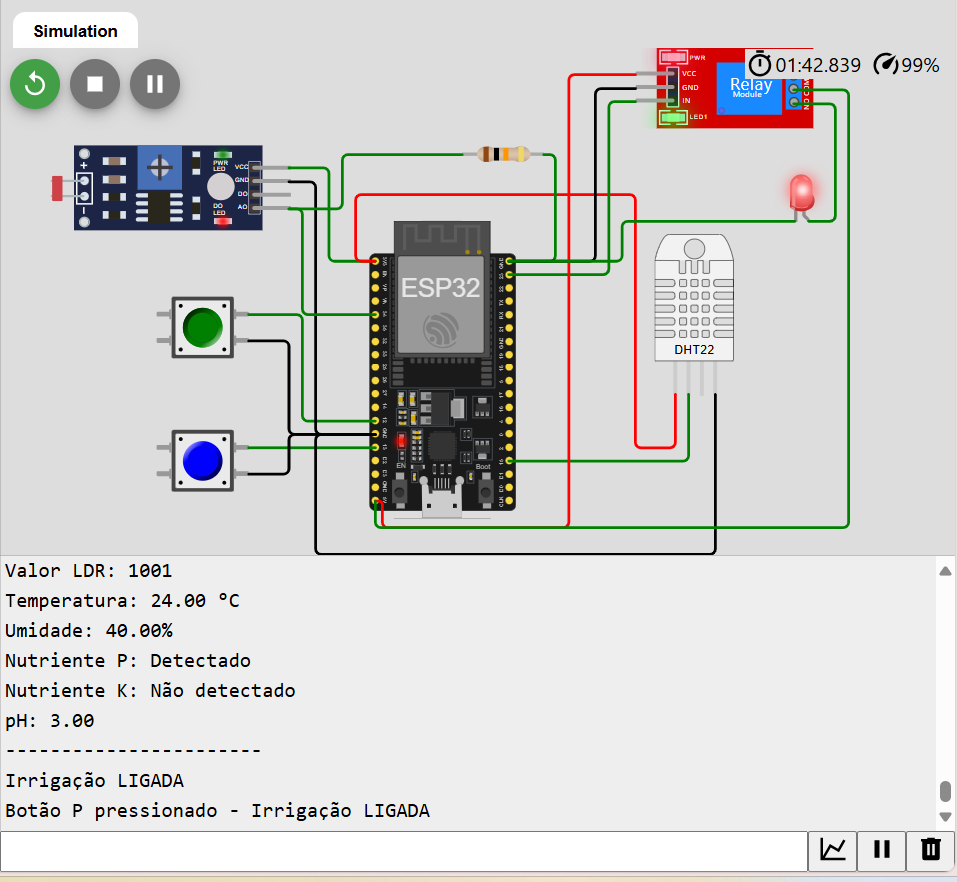

# fase3
# Sistema de Irrigação Automatizado e Inteligente

## Descrição
Este projeto visa desenvolver um sistema de irrigação automatizado e inteligente para a empresa FarmTech Solutions. O sistema utiliza sensores para monitorar a umidade do solo, os níveis de nutrientes fósforo (P) e potássio (K), e o nível de pH, utilizando um sensor LDR. O objetivo é otimizar a irrigação agrícola de acordo com os dados coletados.

## Tecnologias Utilizadas
- **Microcontrolador**: ESP32
- **Plataforma de Simulação**: Wokwi.com
- **Banco de Dados**: MySQL
- **Linguagens de Programação**: Python, C/C++

## Lógica de Controle
O sistema controla a irrigação com base nos seguintes parâmetros:
- **Umidade do Solo**: Se a umidade estiver abaixo de 30%, a irrigação é ativada.
- **Níveis de Nutrientes**: A irrigação é ativada apenas se ambos os nutrientes (P e K) estiverem presentes.
- **pH**: A irrigação é ajustada se o nível de pH estiver abaixo de 6.0.

### Condições para Ativar a Irrigação
- Ativar a irrigação se:
  - Umidade < 30%
  - pH < 6.0
  - Nutrientes P e K disponíveis (True)

### Estrutura do Código
- **Conexão com o Banco de Dados**: O sistema se conecta a um banco de dados MySQL para armazenar e consultar os dados coletados dos sensores.
- **CRUD**: O código implementa operações de criação, leitura, atualização e exclusão dos dados dos sensores no banco de dados.

## Circuito
 <!-- Substitua pelo nome do arquivo da imagem do seu circuito -->

## Código-Fonte
- O código C/C++ desenvolvido para o ESP32 está localizado na pasta `src`.
- O código Python que faz a consulta ao banco de dados Oracle também está na pasta `src`.

## Demonstração em Vídeo
O funcionamento completo do projeto pode ser visualizado no vídeo a seguir:
[Link do Vídeo de Demonstração](https://www.youtube.com/watch?v=SEU_LINK_AQUI) <!-- Substitua pelo link do seu vídeo -->

## Como Executar
1. Clone o repositório em sua máquina local.
2. Instale as dependências necessárias (MySQL Connector para Python).
3. Configure o banco de dados com as tabelas necessárias.
4. Execute o código do ESP32 na plataforma Wokwi.com.
5. Execute o código Python para coletar e armazenar dados dos sensores.

